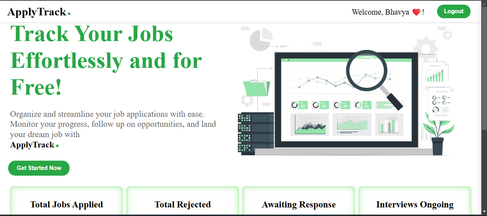
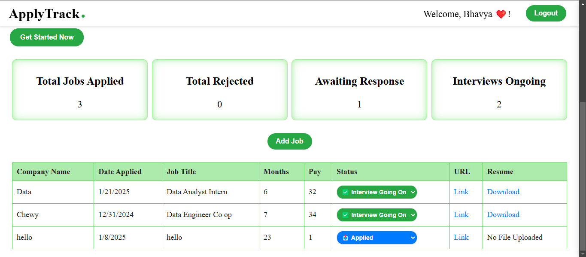
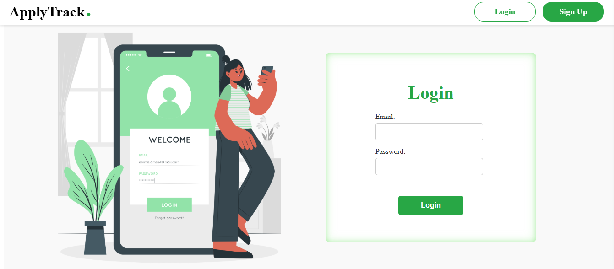
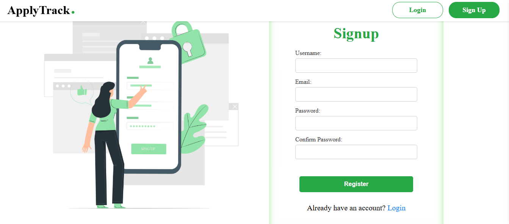

# 🌟 ApplyTrack - Your Ultimate Job Tracker 🌟

## 🚀 Track Your Jobs Effortlessly & For Free! 💼✨

**ApplyTrack** is your all-in-one platform to organize and streamline your job applications, absolutely **free**! Whether you're looking for your first job or aiming for your dream role, ApplyTrack is here to help you keep track of every opportunity.

---

## 🔗 Live Demo
[👉 Try ApplyTrack Now](https://job-tracker-coop-search.vercel.app/)

## 📷 Screenshots

### 🎉 Welcome Page
A welcoming dashboard showing dynamic statistics and options for job tracking.

---

### 📋 Table Details
Comprehensive table displaying detailed job information like company name, job title, and more.

---

### 🔑 Login Page
Simple and secure login interface for users to access their job tracking dashboard.

---

### ✍️ Signup Page
User-friendly signup form to create a personalized job tracking account.

---

## 🔥 Why Use ApplyTrack? 🔥
- ✅ **Effortless Job Tracking**: Manage your job applications in one place.
- ✅ **Dynamic Stats**: Visualize your job search progress.
- ✅ **User-Friendly Interface**: Minimalist, intuitive design.
- ✅ **Fully Responsive**: Optimized for all devices.
- ✅ **Secure**: Individual login and signup.
- ✅ **Completely Free**: No hidden fees or subscriptions!
---

## 🛠️ Tech Stack 🛠️

### 🖥️ **Frontend**
- **React.js** ⚛️
- **CSS** 🎨

### 🌐 **Backend**
- **Express.js** 🚀
- **Node.js** 🌲
- **MongoDB** 🍃

### ☁️ **Deployment**
- **Vercel** 🚀

---

## ✨ Features ✨

### 📌 **Hero Section**
- A visually appealing introduction with an inspiring message and a sleek **hero image** to kickstart your tracking journey.

### 📊 **Job Statistics** 
- Stay on top of your job search with **dynamic stats**:
  - **Total Jobs Applied**: Keep a count of all your applications.
  - **Total Rejected**: See how many jobs you've been rejected for.
  - **Awaiting Response**: Know which applications are pending a response.
  - **Interviews Ongoing**: Track jobs where interviews are in progress.

### 📝 **Job Details Table**
- View detailed job information:
  - **Company Name**
  - **Job Title**
  - **Date Applied**
  - **Job Description URL** 🌐
  - **Resume Upload for Each Job** 📄
  - **Co-op Duration (Months)** ⏳
  - **Pay for the Role** 💰

### ➕ **Add Job**
- Easily add new job opportunities with all relevant details:
  - Company name, job title, application date, URL, resume, and more.

### 🔐 **Login & Signup**
- Secure access for individual users to track their jobs privately.

### 🎨 **Responsive UI**
- A **clean and intuitive interface** designed to work seamlessly across devices (desktop, tablet, and mobile). 📱💻

---

## 💻 Happy Coding! 😊🚀
