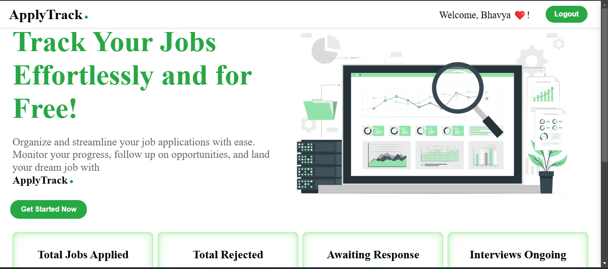
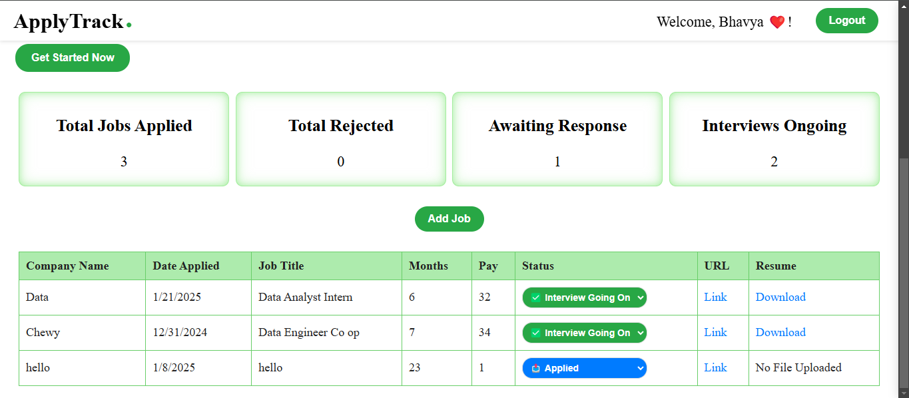
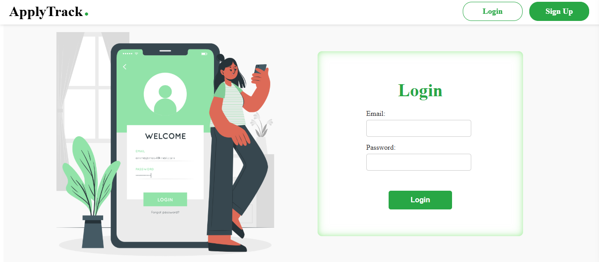
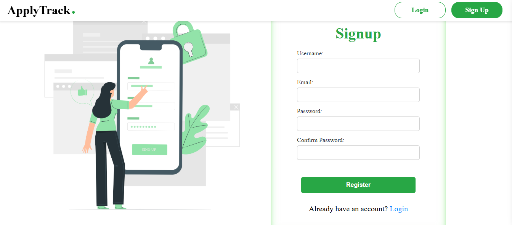

# 🌟 ApplyTrack - Your Ultimate Job Tracker 🌟

## 🚀 Track Your Jobs Effortlessly & For Free! 💼✨

**ApplyTrack** is your all-in-one platform to organize and streamline your job applications, absolutely **free**! Whether you're chasing your first co-op, switching careers, or aiming for your dream role, ApplyTrack helps you stay on top of every opportunity — track each application, watch your stats update live, and keep your daily momentum going with a built-in consistency streak. 🔥

---

## 🔗 Live Demo
[👉 Try ApplyTrack Now](https://job-tracker-coop-search.vercel.app/)

## 📷 Screenshots

### 🎉 Welcome Page
A welcoming dashboard showing dynamic statistics and options for job tracking.

---

### 📋 Table Details
Comprehensive table displaying detailed job information like company name, job title, and more.

---

### 🔑 Login Page
Simple and secure login interface for users to access their job tracking dashboard.

---

### ✍️ Signup Page
User-friendly signup form to create a personalized job tracking account.

---

## 🔥 Why Use ApplyTrack? 🔥
- ✅ **Effortless Job Tracking**: Manage all your job applications in one clean place.
- ✅ **Dynamic Stats**: Visualize your job search progress at a glance.
- ✅ **Consistency Streak**: Stay motivated with a weekday streak that rewards daily applying.
- ✅ **Lightning-Fast Search**: Find any company instantly as you type.
- ✅ **Smart Pagination**: Loads only what you need, so big lists stay snappy.
- ✅ **User-Friendly Interface**: Minimalist, intuitive design.
- ✅ **Fully Responsive**: Optimized for all devices.
- ✅ **Secure**: Individual login and signup with protected, per-user data.
- ✅ **Completely Free**: No hidden fees or subscriptions!
---

## 🛠️ Tech Stack 🛠️

### 🖥️ **Frontend**
- **React** ⚛️
- **React Router** 🧭
- **CSS** 🎨
- **HTML** 
- **Javascript** 

### 🌐 **Backend**
- **Express.js** 🚀
- **Node.js** 🌲
- **JWT Authentication** 🔐

### **Database**
- **MongoDB** 🍃 (with **Mongoose** ODM)

### ☁️ **Deployment**
- **Vercel** 🚀

---

## ✨ Features ✨

### 📌 **Hero Section**
- A visually appealing introduction with an inspiring message and a sleek **hero image** to kickstart your tracking journey.

### 📊 **Job Statistics** 
- Stay on top of your job search with **dynamic stats**, computed live across all your applications:
  - **Jobs Applied Today**: See how many applications you've sent today.
  - **Total Jobs Applied**: Keep a count of all your applications.
  - **Total Rejected**: See how many jobs you've been rejected for.
  - **Streak (Weekdays)**: Track your consecutive weekday streak — Saturdays and Sundays are skipped, so weekends never break your momentum. 💪
  - **Interviews Ongoing**: Track jobs where interviews are in progress.

### 📝 **Job Details Table**
- View detailed job information at a glance:
  - **Company Name**
  - **Date Applied** 📅
  - **Job Title**
  - **Status** — update an application's stage right from the table.
  - **Referral** — see whether a job came through a referral, along with the referrer's name. 🤝

### 🔍 **Real-Time Search**
- Instantly filter your applications by company name as you type, with debounced requests for a smooth, efficient experience.

### 📄 **Smart Pagination**
- Applications load **10 per page**, fetched from the server on demand — so the app stays fast even with hundreds of entries.

### ➕ **Add Job**
- Easily add new job opportunities with all the relevant details:
  - Company name, application date, job title, referral type (with referrer name), and current status.

### 🔐 **Login & Signup**
- Secure access for individual users to track their jobs privately, backed by JWT-based authentication.

### 🎨 **Responsive UI**
- A **clean and intuitive interface** designed to work seamlessly across devices (desktop, tablet, and mobile). 📱💻

---

## 💻 Happy Coding! 😊🚀
